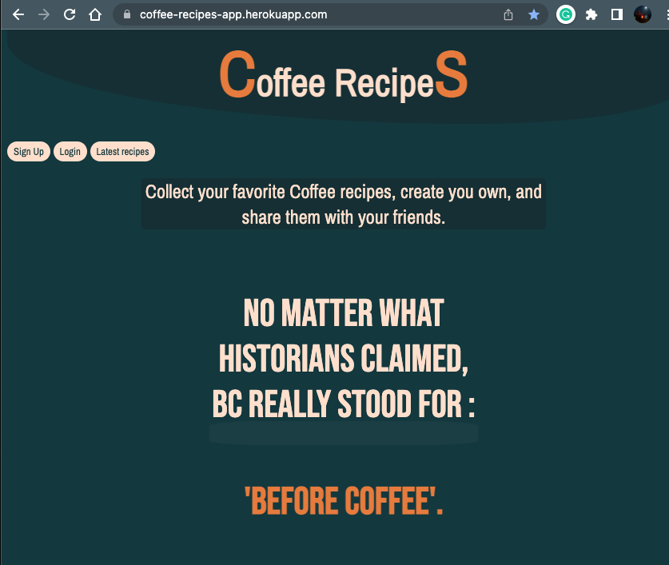
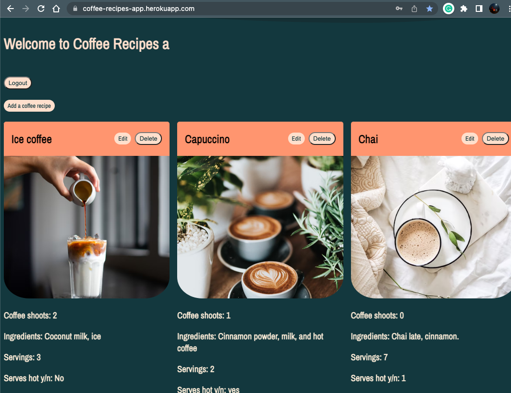

# Coffee Recipes App
Coffee Recipes App is an easy-to-use application where coffee lovers can find, create, and modify recipes for beverages made with coffee.

## :computer: [Click here](https://coffee-recipes-app.herokuapp.com/) to see my live project!

## :speech_balloon: About
- The use of this application is very simple, with a few clicks the users will have the possibility to register themself, make a login and start to share the recipes that they want. The steps are described below:
- 1st left button is designed to Sign Up, 2nd to LogIn and last to check all the recipes added.

## :memo: Planning & Problem Solving
- Talk about approach to the problem.
- Add screenshots/drawings of doodles/plans during the planning phase.
- Flow charts of app logic.

## :rocket: Cool tech
- Ruby
- Sinatra (http://localhost:4567/)
- Animations on CSS
- Libraries

## :scream: Bugs to fix :poop:
- Some of the CSS is not applied as desired.
- The page where the user can see all the recipes does not have the same grid as the page where the recipes are while it is logged.
- When users logIn and there is a wrong password the next page is blank and does not suggest any errors.

## :sob: Lessons learnt
I learnt how to make a shape on CSS for the background and how to implement it on every page keeping same design although the tittle changed.

Sticking to the initial plan make that the outcome real on the time given.

I can write functions to apply based on conditions such as if they are registered what I allow them to do ans see. For example; delete and edit.

## :National Park: Future features
I would like to activated a filter button so users would be able to set their preferences between hot coffee and dairy free options.